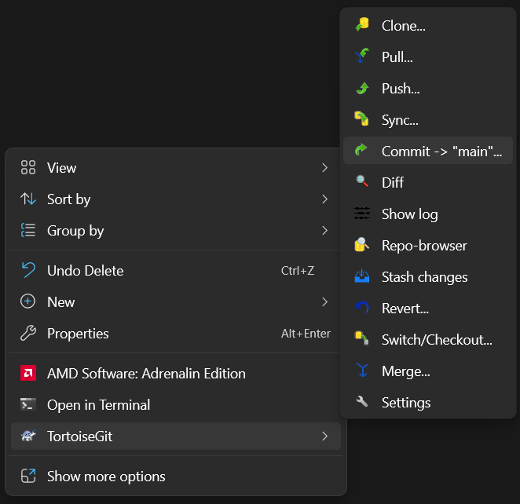
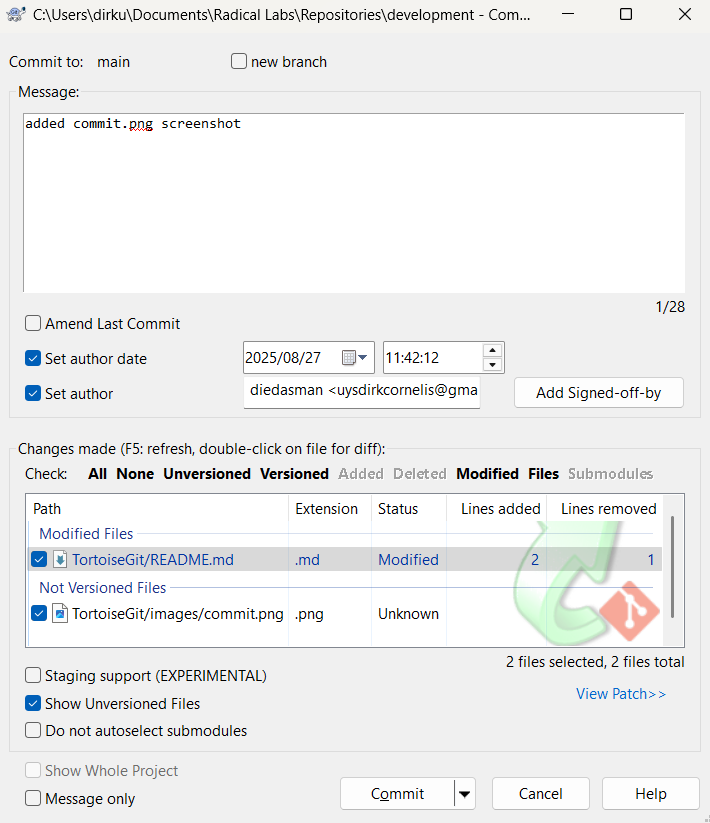
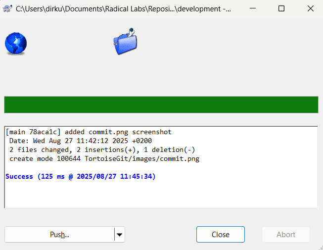
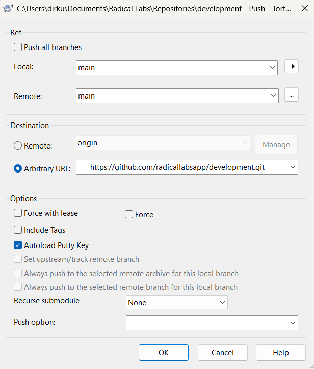

# 🐢 Working with TortoiseGit

- [Workflow Summary](#workflow-summary)
- [Download & Install](#download--install)
- [Cloning the Repository](#cloning-the-repository)
- [Making Changes & Committing](#making-changes--committing)
- [Pushing Your Work](#pushing-your-work)
- [Quick Workflow Recap](#quick-workflow-recap)
  
## 📖 Workflow Summary
1. **Pull** before you start working (Ensures you are working on the latest version) .
2. Make your changes locally.  
3. **Commit** locally with a clear message (Descrbe differences, files added/removed, etc.).  
4. **Push** to share your work.

## 🖥️ Download & Install
If you are using **TortoiseGit** (Windows Git client), here’s how to work with this repository.
1. Download TortoiseGit (from the official site) -> [https://tortoisegit.org/](https://tortoisegit.org/download/)
2. Run the Setup Wizard
3. Click `Next` (3 times) then `Install`
4. Use your GitHub credentials when signing in during install
5. Leave all settings as default

---

## ⬇️ Cloning the Repository
1. Right-click in the folder where you want the repo.  

2. Hover over **TortoiseGit** and Select **Clone...**
    
   

3. Paste the repo `URL`. Get the URL from **Code** and copy the HTTP link.
   Leave the other fileds empty.
    
   
   
4. Click **OK** – TortoiseGit will download the files.
   When finished click `Close`
    
   

---

## 💾 Making Changes & Committing
1. Right-click the repo folder → **TortoiseGit → Pull** (to get the latest version).
    
   

2. Edit your files locally.  

3. Right-click the repo folder → **TortoiseGit → Commit -> "main"...** (or your branch).
    
   

4. Enter a **clear commit message**, select changed files, and click **Commit**.
    
   

---

## ⬆️ Pushing Your Work
1. After committing, the following pop-up will appear.
    
   
   
2. Click **Push**.
   
3. Confirm the correct remote `Arbitrary URL` and leave other fileds as default.
   The URL can be obtained from the `Code` button in the repository GitHub page
    
   
    
5. Click **OK** – your changes will be uploaded.
   
---

## 🔁 Quick Workflow Recap
1. **Pull** before you start working.  
2. Make your changes.  
3. **Commit** locally with a clear message.  
4. **Push** to share your work.

---
