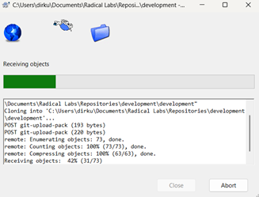

---

## 🐢 Working with TortoiseGit

### ✅ Workflow Summary
1. **Pull** before you start working.  
2. Make your changes.  
3. **Commit** locally with a clear message.  
4. **Push** to share your work.

If you are using **TortoiseGit** (Windows Git client), here’s how to work with this repository.

1. Download TortoiseGit (from the official site) -> [https://tortoisegit.org/](https://tortoisegit.org/download/)
2. Run the Setup Wizard
3. Click `Next` (3 times) then `Install`
4. **Additional Steps Missing**

---

### 🔽 Cloning the Repository
1. Right-click in the folder where you want the repo.  

2. Hover over **TortoiseGit** and Select **Clone...**  
   

3. Paste the repo URL. Get the URL from **Code** and copy the HTTP link.
   
   
4. Click **OK** – TortoiseGit will download the files.  
   

---

### ✍️ Making Changes & Committing
1. Right-click the repo folder → **TortoiseGit → Pull** (to get the latest version).  
   

2. Edit your files as needed.  

3. Right-click the repo folder → **Git Commit → "master"** (or your branch).  
   

4. Enter a **clear commit message**, select changed files, and click **Commit**.  
   

---

### ⬆️ Pushing Your Work
1. After committing, right-click the repo folder.  
2. Choose **TortoiseGit → Push**.  
   

3. Confirm the correct remote (`origin`) and branch.  
4. Click **OK** – your changes will be uploaded.  
   

---

### ✅ Quick Workflow Recap
1. **Pull** before you start working.  
2. Make your changes.  
3. **Commit** locally with a clear message.  
4. **Push** to share your work.

---
